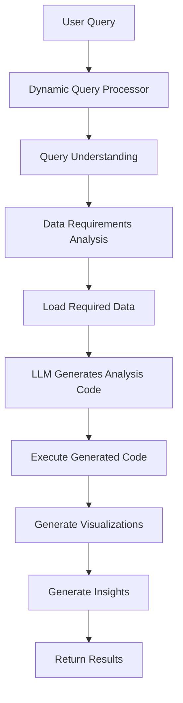

# Pharmaceutical Analytics System Architecture

## Core Principle: Dynamic LLM-Generated Analysis

The system uses Large Language Models (LLMs) to **dynamically generate** analysis code for each specific query, rather than relying on pre-written statistical methods. This allows for unlimited flexibility and query-specific optimizations.

## System Flow



## Key Components

### 1. Dynamic Query Processor (`dynamic_query_processor.py`)
- **Purpose**: Main orchestrator for query processing
- **Key Features**:
  - Understands query intent using LLM
  - Determines data requirements
  - Coordinates code generation and execution
  - Handles visualization and insights generation

### 2. Query Analyzer (`query_analyzer.py`)
- **Purpose**: Uses LLM to generate custom analysis code
- **Key Methods**:
  - `generate_analysis_code()`: Creates query-specific statistical analysis
  - `execute_analysis()`: Safely executes generated code
  - `generate_visualization_code()`: Creates custom visualization code

### 3. Data Loader (`data_loader.py`)
- **Purpose**: Interface to BigQuery datasets
- **Available Datasets**:
  - `rx_claims`: Prescription claims data
  - `medical_claims`: Medical claims data
  - `providers_bio`: Healthcare provider information
  - `provider_payments`: Provider payment data

## How It Works

### Step 1: Query Understanding
```python
# LLM analyzes the query to understand:
- What type of analysis is needed
- Which datasets are required
- What drugs/time periods/geographies are involved
```

### Step 2: Dynamic Code Generation
```python
# LLM generates custom analysis code:
- Statistical tests appropriate for the query
- Data aggregations and transformations
- P-value calculations
- Result formatting
```

### Step 3: Execution
```python
# Generated code is executed in a controlled environment:
- Access to pandas, numpy, scipy, sklearn
- Access to loaded data
- Results captured and validated
```

### Step 4: Visualization
```python
# LLM generates visualization code:
- Appropriate chart types for the data
- Professional formatting for pharma researchers
- Saved to images/ directory
```

## Example Query Flow

**Query**: "What types of doctors prescribe Tremfya over Rinvoq?"

1. **Understanding**: LLM identifies this as a competitive prescriber analysis
2. **Data Loading**: Loads rx_claims filtered for these drugs
3. **Generated Analysis**:
   ```python
   # LLM generates code like:
   tremfya_prescribers = df[df['NDC_PREFERRED_BRAND_NM'] == 'Tremfya']
   rinvoq_prescribers = df[df['NDC_PREFERRED_BRAND_NM'] == 'Rinvoq']
   
   # Specialty analysis
   specialty_comparison = pd.crosstab(
       df['PRESCRIBER_NPI_HCP_SEGMENT_DESC'],
       df['NDC_PREFERRED_BRAND_NM']
   )
   
   # Statistical testing
   chi2, p_value = stats.chi2_contingency(specialty_comparison)
   
   results = {
       'specialty_preference': specialty_comparison,
       'p_value': p_value,
       'interpretation': 'Significant difference' if p_value < 0.05 else 'No difference'
   }
   ```

4. **Visualization**: Creates bar charts and heatmaps showing specialty preferences
5. **Insights**: Generates market research insights based on results

## Advantages of Dynamic Generation

1. **Unlimited Flexibility**: Can handle any pharmaceutical query
2. **Query-Specific Optimization**: Generates the exact analysis needed
3. **Evolving Capabilities**: Improves as LLM capabilities improve
4. **No Fixed Methods**: Not limited by pre-written statistical functions
5. **Contextual Understanding**: Generates appropriate methods for pharma domain

## Configuration

Key settings in `config.py`:
- `OPENAI_API_KEY`: API key for LLM access
- `BIGQUERY_PROJECT_ID`: Google Cloud project
- `MODEL_CONFIG`: 
  - Uses `gpt-4o` - OpenAI's best model for code generation
  - Temperature: 0.1 for consistent, accurate code
  - Max tokens: 3000 for comprehensive analysis
- `VIZ_CONFIG`: Visualization output settings (images/ directory)

## Data Flow

```
BigQuery --> Data Loader --> Dynamic Processor --> LLM
                                    |
                                    v
                         Generated Analysis Code
                                    |
                                    v
                              Execution Engine
                                    |
                                    v
                         Results + Visualizations
```

## LLM Optimization for Quality

### Analysis Code Generation
- **Expert System Prompts**: LLM is instructed as an FDA-standard pharmaceutical data scientist
- **Comprehensive Requirements**: Detailed specifications for statistical methods, metrics, and validation
- **Structured Output**: Enforced dictionary structure with results, statistics, methodology, and interpretations

### Visualization Excellence
- **Multi-Panel Figures**: Always generates comprehensive visualizations with subplots
- **Heatmaps**: Automatic inclusion for correlation and comparison data
- **Statistical Annotations**: P-values, confidence intervals, and effect sizes displayed
- **Professional Aesthetics**: Pharmaceutical-grade color schemes and formatting

### Technical Data as Proof
- **Statistical Evidence**: All p-values with interpretations
- **Key Metrics**: Quantitative proof points for insights
- **Data Quality**: Sample size, coverage, and completeness metrics
- **Methodology Documentation**: Transparent analysis approach

## Error Handling

- Invalid queries: LLM provides fallback analysis
- Code generation errors: Retry with improved prompts
- Execution errors: Captured and reported with context
- Visualization errors: Multiple retry attempts before fallback

## Security Considerations

- Generated code runs in controlled namespace
- No file system access beyond data and images
- No network calls from generated code
- Input validation on all user queries